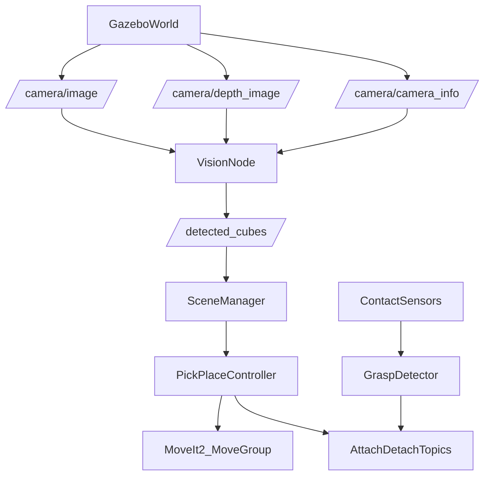

# Cover Page
**Project Title:** Vision-Based Object Detection and Sorting  
**Subtitle:** YOLOv11 vs RT-DETR for Vision-Guided Pick-and-Place Sorting (ROS 2 + Gazebo)  
**Student name and ID:** <Fill>  
**Course / Program:** <Fill>  
**Institution:** <Fill>  
**Date:** February 4, 2026  

---

## 1. Introduction (~0.5 page)

Industrial sorting cells must handle objects that can appear at varying positions and orientations and must do so with high reliability and low latency. Classical approaches (static templates, simple color masking) can fail under occlusion, lighting changes, and clutter. In contrast, modern deep-learning object detectors can generalize better, but they introduce a key trade-off: **detection robustness vs. computational latency**, which directly affects manipulation success in real time.

This project designs and implements a **ROS 2 + Gazebo** simulation of a vision-guided sorting robot using a **UR5e manipulator** with a **Robotiq 2F-85 gripper** and an **overhead RGB‑D camera**. The perception system publishes 3D object positions derived from RGB detections and depth, and the control system uses MoveIt 2 to plan and execute pick-and-place motions into predefined bins. The core research contribution is a comparison between two detector families:

- **YOLOv11** (CNN-based, optimized for speed)
- **RT-DETR** (Transformer-based, NMS-free detection head, optimized for robustness)

**Contributions of this project include:**
- A Gazebo sorting scene with UR5e + Robotiq gripper and four cubes (big/small red/green) and an overhead RGB‑D camera.
- Two detector integrations (YOLOv11 and RT‑DETR) that publish 3D cube poses to the ROS 2 pipeline.
- A modular ROS 2 architecture (vision, scene state, grasp detection, motion control).
- Headless benchmarking of inference latency for YOLOv11 vs RT‑DETR, with logged metrics and reproducible workflow.

---

## 2. Algorithms (~1–2 pages)

### 2.1 Overview of Algorithms

The system combines perception, geometry, and motion planning:

- **Object Detection (YOLOv11 / RT‑DETR):** detects cubes in RGB images and outputs bounding boxes, class labels, and confidence.
- **Size Classification:** classifies cubes as *big* vs *small* using bounding-box area thresholding.
- **3D Pose Estimation from RGB‑D:** converts 2D detection centers + depth into 3D coordinates in the robot base frame.
- **Motion Planning (MoveIt 2 / OMPL):** plans collision-aware arm trajectories to approach, grasp, lift, and place.
- **Grasp/Release Logic:** uses Gazebo contact sensing and DetachableJoint attach/detach topics to emulate grasping.

### 2.2 Algorithm Details

#### Algorithm A: YOLOv11 (CNN-based)
- **Purpose:** fast object detection suitable for real-time robotics.
- **Assumptions:** objects (cubes) are visible from the overhead camera and belong to trained classes; GPU acceleration available for best performance.

#### Algorithm B: RT-DETR (Transformer-based)
- **Purpose:** robust object detection with global context reasoning and simplified post-processing (NMS-free).
- **Assumptions:** similar to YOLOv11; transformer inference tends to require more compute and memory.

#### 3D pose estimation (pixel-to-world with depth)
For each detection:
1. Compute bounding box center pixel \( (u, v) \).
2. Read depth \( d \) (median over a small region around the center).
3. Convert pixel + depth to world/robot coordinates using calibrated camera intrinsics and known camera pose.

In this implementation (overhead, looking down), a linearized mapping is used with coefficients derived and verified for the specific camera configuration.

#### Size classification (big vs small)
Bounding box area \( A = (x_2-x_1)(y_2-y_1) \) is compared to a threshold:
- if \( A > 5000 \Rightarrow \) **big**
- else **small**

### 2.3 Implementation Details (ROS 2)

**Programming language:** Python  
**Key ROS 2 nodes:**
- `vision_node.py`: subscribes to `/camera/image`, `/camera/depth_image`, `/camera/camera_info`; publishes `/detected_cubes` (JSON), `/vision/raw_image`, `/vision/annotated_image`.
- `scene_manager.py`: consumes `/detected_cubes` and serves cube state to the controller.
- `pick_place_controller.py`: requests cube poses, plans with MoveIt 2, executes pick-and-place.
- `grasp_detector.py`: monitors contact + gripper state; publishes attach/detach commands.
- `pose_logger.py`: logs ground-truth cube poses from Gazebo for debugging.

**Communication (topics/services/actions):**
- Camera topics: `/camera/image`, `/camera/depth_image`, `/camera/camera_info`
- Vision output: `/detected_cubes` (String JSON)
- Gripper attach/detach bridges: `/gripper/attach_*`, `/gripper/detach_*`
- MoveIt 2: MoveGroup action and planning services (internal MoveIt topics/services)

---

## 3. Design Choices (~1–2 pages)

### 3.1 Robot Model
- **Robot:** UR5e manipulator  
- **Gripper:** Robotiq 2F-85  
- **Simulation:** Gazebo Harmonic  
- **Kinematic assumptions:** rigid-link serial manipulator; motion planned with MoveIt 2.

### 3.2 Sensors
- **Overhead RGB‑D camera** in Gazebo:
  - RGB: 640×480  
  - Depth: aligned depth image  
  - Purpose: detect cubes and recover 3D position from depth.
  - Limitation: depth noise/NaNs possible; mitigated via median sampling in a small region.

### 3.3 ROS 2 Architecture

System is organized as a perception → scene state → control pipeline:



**Node responsibilities:**
- **Perception (`vision_node.py`)**: detection + 3D pose inference.
- **Planning/Control (`pick_place_controller.py`)**: pick-and-place planning and execution.
- **Grasping (`grasp_detector.py`)**: realistic attach/detach triggers from contact.

### 3.4 Design Rationale (Trade-offs)
- **Accuracy vs computation:** YOLOv11 offers lower latency; RT‑DETR offers slightly higher precision in training metrics but significantly higher inference time.
- **Simplicity vs scalability:** JSON message for detections is simple for iteration; for scalability, a typed message (e.g., `geometry_msgs/PoseArray` + class IDs) would be preferable.
- **Simulation vs real-world:** DetachableJoint and contact sensors approximate grasping; real hardware would require force/torque sensing and gripper compliance.

---

## 4. Performance Analysis (~1–1.5 pages)

### 4.1 Evaluation Metrics

Per the project objective, the following metrics were used:
- **Speed (ms):** mean inference latency per frame (measured in `vision_node.py` using `time.perf_counter()`).
- **Accuracy (%):** in this evaluation, accuracy is reported as **detection completeness per frame** (did the system detect all cubes in the scene).  
  - Note: pick-and-place success rate (successful grasps/places out of 10 attempts) is listed as an extension test; see Section 5.3.
- **Robustness:** consistency of detections over time in headless simulation; occlusion/lighting stress tests are defined and proposed in Section 5.3.

### 4.2 Quantitative Results

**Headless benchmark setup:** Both detectors were run headlessly in Gazebo (`gazebo_gui:=false`). Metrics were logged to CSV files:
- `comparison/yolo_metrics.csv`
- `comparison/rtdetr_metrics.csv`

**Warm-up handling:** the first frame includes model initialization overhead; the reported statistics **exclude the first frame**.

| Metric (no warm-up) | YOLOv11 | RT-DETR |
|---|---:|---:|
| Frames analyzed | 41 | 41 |
| Avg inference time | **26.89 ms** | **95.23 ms** |
| Std dev | 9.22 ms | 20.02 ms |
| Min / Max | 15.12 / 65.66 ms | 78.49 / 178.03 ms |
| Avg detections per frame | 6.0 | 6.0 |

**Speed ratio:** RT‑DETR / YOLOv11 \(= 95.23 / 26.89 \approx 3.54\).  
YOLOv11 was **~3.54× faster** in this environment.

### 4.3 Qualitative Analysis

- **Detection stability:** both detectors produced stable detections across the benchmark run (constant detection count).
- **Timing stability:** YOLOv11 showed lower variance; RT‑DETR showed higher variance and higher latency (expected from transformer inference).
- **Headless operation:** both detectors ran successfully in headless mode for the benchmarked scene.

### 4.4 Discussion

**Strengths:**
- YOLOv11 delivers real-time friendly latency (~27 ms) suitable for closed-loop manipulation.
- RT‑DETR achieves strong precision in training metrics and consistent detections in the headless scene.

**Limitations observed:**
- The benchmark measured **detector inference time** inside the vision node, not full end-to-end system latency (camera bridge + preprocessing + publish + downstream planning).
- Pick-and-place success rate and stress robustness (occlusion/lighting) were not fully automated within the benchmark and are described as follow-up tests (Section 5.3).

---

## 5. Challenges and Lessons Learned (~0.5–1 page)

### 5.1 Technical Challenges
- **Workspace copying and build cache:** copied ROS workspaces required cleaning `build/ install/ log/` to avoid CMake cache source-path mismatch.
- **Headless benchmarking:** ensuring Gazebo headless rendering and camera bridging were functioning before measuring detector timing.
- **System integration complexity:** coordinating timing (launch delays) among Gazebo, controllers, MoveIt, camera bridge, vision node, and scene manager.

### 5.2 Lessons Learned
- **Measure what matters:** separating warm-up from steady-state inference is critical for fair comparisons.
- **Keep architecture modular:** having independent nodes (vision, scene, controller) makes debugging faster.
- **Use structured logging:** CSV logs allow objective analysis and reproducibility.

### 5.3 Future Improvements
- **Pick-and-place accuracy metric:** automate “successful pick actions out of 10 attempts” by logging grasp attach events + final cube placement region checks.
- **Robustness stress tests:** implement scripted occlusion and lighting changes in Gazebo and score detection stability.
- **Swappable detector nodes:** unify YOLO/RT‑DETR under one node with a `detector_type` parameter.
- **Typed detection messages:** replace JSON with ROS messages (e.g., `vision_msgs/Detection3DArray` or a custom msg).
- **End-to-end latency measurement:** time from image receipt → detection publish → planned grasp pose produced → motion start.

---

## 6. Conclusion (~0.5 page)

This project implemented a complete simulated vision-guided sorting pipeline in ROS 2 and Gazebo using an RGB‑D camera for 3D perception and MoveIt 2 for motion planning. Two detectors were integrated and benchmarked headlessly.

**Final outcome:** In steady-state inference, **YOLOv11 averaged 26.89 ms per frame**, while **RT‑DETR averaged 95.23 ms**, making YOLOv11 **~3.54× faster** in this setup. Both detectors were stable in the tested scene. For real-time manipulation tasks where reaction time is critical, **YOLOv11 is the recommended detector** for this project’s constraints and environment.

---

## References (IEEE / APA consistent format)

1. W. Lv, Y. Zhao, et al., “DETRs Beat YOLOs on Real-time Object Detection,” *Proceedings of CVPR*, 2024.  
2. Ultralytics, “Ultralytics YOLO Documentation,” 2026.  
3. ROS 2 Documentation, “ROS 2 Jazzy,” 2026.  
4. MoveIt 2 Documentation, “MoveIt 2 Motion Planning Framework,” 2026.  
5. Gazebo (gz-sim) Documentation, “Gazebo Harmonic Simulator,” 2026.  
6. S. Nikhileswara Rao, “YOLOv11 Architecture Explained: Enhanced Speed and Accuracy,” (online article), 2024.  

---

## Appendix (Optional)

### A. Reproducibility: Benchmark Commands (Headless)

**YOLOv11**
```bash
pkill -9 -f gz && pkill -9 -f ros && pkill -9 -f ruby
cd /home/beki/Vision-Based-Object-Detection-and-Sorting/comparison/Comp_perfect_size_v3/ros2_ws
source /opt/ros/jazzy/setup.bash
rm -rf build install log
colcon build --symlink-install
source install/setup.bash
ros2 launch simpler_bringup scene.launch.py gazebo_gui:=false
```

**RT‑DETR**
```bash
pkill -9 -f gz && pkill -9 -f ros && pkill -9 -f ruby
cd /home/beki/Vision-Based-Object-Detection-and-Sorting/comparison/Comp_perfect_RT_v1/ros2_ws
source /opt/ros/jazzy/setup.bash
rm -rf build install log
colcon build --symlink-install
source install/setup.bash
ros2 launch simpler_bringup scene.launch.py gazebo_gui:=false
```

### B. Key Output Artifacts
- Final comparison report: `/home/beki/Vision-Based-Object-Detection-and-Sorting/comparison/COMPARISON_REPORT.md`
- Final project report (this file): `/home/beki/Vision-Based-Object-Detection-and-Sorting/comparison/FINAL_PROJECT_REPORT.md`
- YOLO metrics: `/home/beki/Vision-Based-Object-Detection-and-Sorting/comparison/yolo_metrics.csv`
- RT‑DETR metrics: `/home/beki/Vision-Based-Object-Detection-and-Sorting/comparison/rtdetr_metrics.csv`

